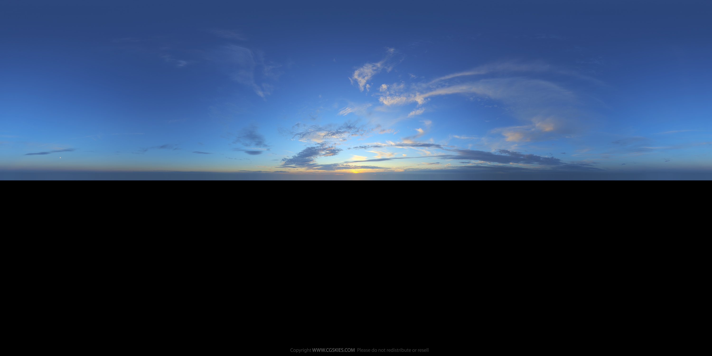

<a-scene inspector stats physics="debug: true">

	<!-- Assets -->

	<a-assets>
		<a-asset-item id="Feisar-ship-obj" src="a-frame-assets/Feisar_Ship_OBJ/Feisar_Ship.obj"></a-asset-item>
		<a-asset-item id="Feisar-ship-mtl" src="a-frame-assets/Feisar_Ship_OBJ/Feisar_Ship.mtl"></a-asset-item>

		<a-asset-item id="race-track-obj" src="a-frame-assets/race-track/race-track.obj"></a-asset-item>
		<a-asset-item id="race-track-mtl" src="a-frame-assets/race-track/race-track.mtl"></a-asset-item>

		

		<!-- Sky is free sample sky from cgskies, buy one for commecial use -->
		
	</a-assets>

	<!-- CAMERA -->

	<a-entity look-at="#ship" follow="target: #ship-camera-target;">
		<a-entity position="0 2 0" rotation="0 180 0">

			<!-- Disable the default wasd controls we are using those to control the ship -->
			<a-camera wasd-controls="enabled: false;"></a-camera>
		</a-entity>
	</a-entity>

	<!-- this is moved by the controller, it's rotation is set to the normal of ther service it is on' -->
	<a-entity ship-controller="easing: 2; acceleration: 40; rollTarget: #ship; turnTarget: #controller-target;">

		<!-- This is rotated by the controller -->
		<a-entity id="controller-target" rotation="0 -90 0">
			<a-entity	id="ship-camera-target" position="0 0 -8"></a-entity>

			<!-- this rolled by the controller -->
			<a-obj-model src="#Feisar-ship-obj" mtl="#Feisar-ship-mtl" position="0 0.2 0" scale="0.3 0.3 0.3" rotation id="ship">
				<a-torus-knot position="0 4 -5" material="shader: super-standard; sphericalEnvMap: #cgsky; color: #8ab39f; normalMap: #water-normal; metalness: 1; roughness: 0.2; normalTextureRepeat: 50 50 50; opacity: 0.8;"></a-torus-knot>
			</a-obj-model>
		</a-entity>
	</a-entity>

	<!-- ENVIRONMENT -->

	<a-sky src="#cgsky" position="0 -1 0" rotation="0 -90 0"></a-sky>
	<a-entity light="color: #4c7cc2; intensity: 0.4; type: ambient;"></a-entity>
	<a-entity light="color: #fffab7; intensity: 1.5" position="0 1 -5" id="sun"></a-entity>
	<a-ocean-plane material="normalMap: #water-normal; sphericalEnvMap: #cgsky;"></a-ocean-plane>

	<!-- TRACK -->

	<a-curve id="track" curve="CatmullRom">
		<a-curve-point position="30 -10 0"></a-curve-point>
		<a-curve-point position="0 0 0"></a-curve-point>
		<a-curve-point position="-60 4 30"></a-curve-point>
		<a-curve-point position="-60 10 60"></a-curve-point>
		<a-curve-point position="-60 10 120"></a-curve-point>
		<a-curve-point position="-60 50 180"></a-curve-point>
		<a-curve-point position="-60 10 240"></a-curve-point>
	</a-curve>

	<!--<a-draw-curve curve="#track" material="shader: line; color: red;"></a-draw-curve>-->

	<a-entity floor-track clone-along-curve="curve: #track; spacing: 6; scale: 1.5 1 2;" obj-model="obj: #race-track-obj; mtl: #race-track-mtl;"></a-entity>

</a-scene>

